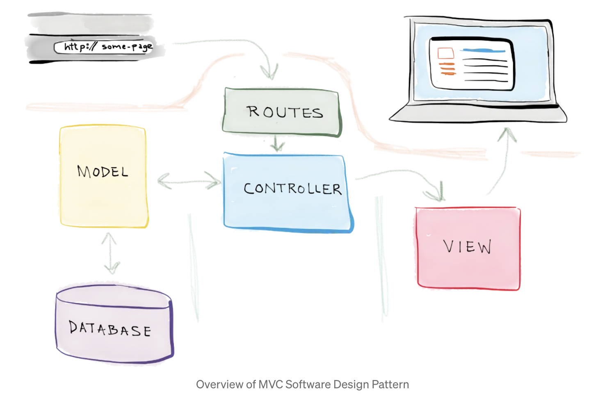
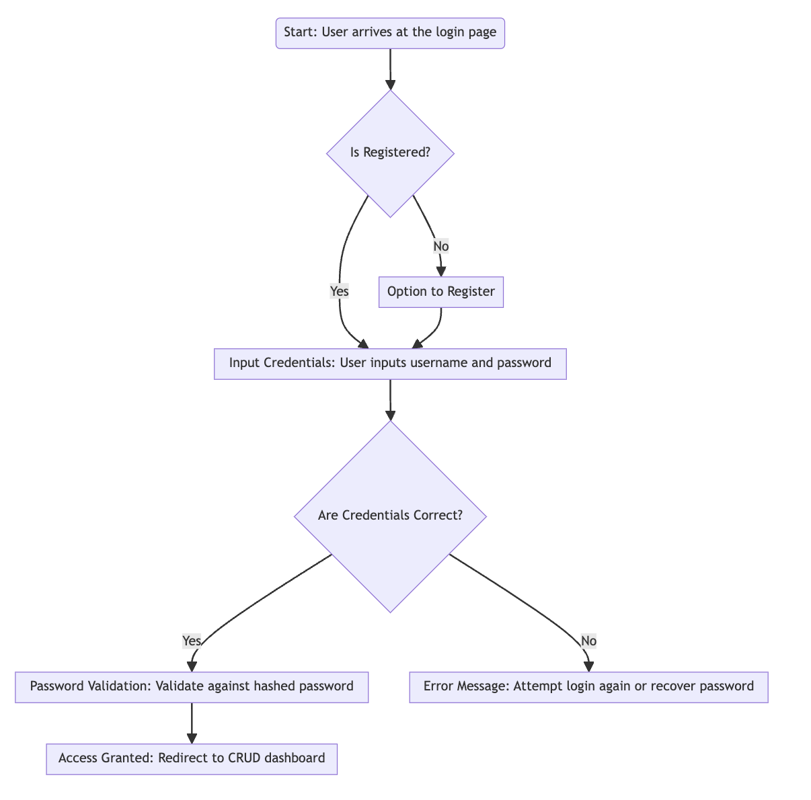
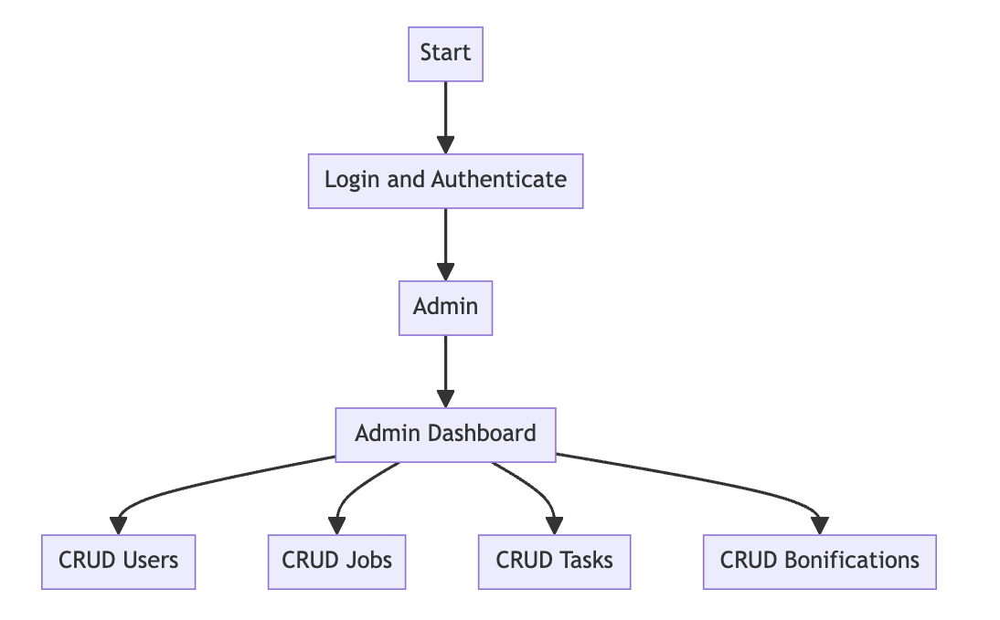

Ingeniería web - Sistema de gestión de usuarios
Este proyecto constituye la fase fundamental del desarrollo del sistema, integrando funcionalidades esenciales que permiten a los usuarios interactuar de manera eficaz con la plataforma. Admite el registro de usuarios, el inicio de sesión y amplias funciones de gestión de usuarios. Los usuarios autenticados pueden realizar operaciones CRUD (Crear, Leer, Actualizar, Eliminar) en los datos de los usuarios, lo que ofrece una experiencia de gestión de usuarios sólida y eficiente.

Introducción
Esta aplicación web representa una solución integral diseñada para gestionar y proteger los datos de los usuarios de manera eficaz. Utilizando Flask como marco de servidor y SQLite para la gestión de bases de datos, este proyecto se centra en la creación de un entorno seguro donde las interacciones de los usuarios sean seguras y eficientes. El sistema emplea contraseñas con hash y cookies para garantizar que las rutas y las sesiones de los usuarios se gestionen de forma segura, lo que proporciona una interfaz fiable y fácil de usar para las tareas administrativas.

Tecnologías utilizadas
Backend
Flask: actúa como columna vertebral de la aplicación web, gestionando solicitudes y respuestas, enrutamiento y lógica del lado del servidor.
SQLite: se utiliza para la gestión de bases de datos, almacena y recupera todos los datos de los usuarios según lo solicitado por la lógica de la aplicación, lo que garantiza un manejo sólido de los datos.
Interfaz de usuario
El proyecto utiliza HTML, CSS y JavaScript para ofrecer una interfaz de usuario intuitiva y con capacidad de respuesta, lo que proporciona a los usuarios una experiencia de interacción fluida.

Seguridad
Contraseñas cifradas: para mejorar la seguridad, la aplicación implementa contraseñas cifradas, lo que garantiza que las credenciales de usuario se almacenen de forma segura en la base de datos.
Cookies: se utilizan para gestionar sesiones y mantener el estado del usuario en las distintas páginas de la aplicación.
Paquetes
Flask-Login: gestiona la autenticación de usuarios y proporciona herramientas para iniciar y cerrar la sesión de los usuarios en la aplicación.
Flask-Migrate: se utiliza para gestionar las migraciones de bases de datos SQLAlchemy para aplicaciones Flask.
Flask-Bcrypt: proporciona utilidades de cifrado para aplicaciones Flask para ayudar a almacenar de forma segura las contraseñas de los usuarios.
Arquitectura MVC
El proyecto sigue el patrón arquitectónico MVC (modelo-vista-controlador), que separa la lógica de la aplicación en tres componentes interconectados. Este patrón ayuda a organizar la base de código, lo que la hace más modular y fácil de mantener.

Modelo
El modelo representa la capa de datos de la aplicación. Define la estructura de la base de datos e incluye la lógica para recuperar y almacenar datos.

Modelos: Usuario, Tarea, Trabajo, Estado
Base de datos: SQLite

Vista
La Vista representa la capa de presentación de la aplicación. Es responsable de representar la interfaz de usuario y mostrar los datos recuperados del modelo.

Plantillas: Archivos HTML que representan la interfaz de usuario (por ejemplo, users.html, jobs.html, task.html, bonificacion.html)

Controlador
El Controlador maneja la entrada del usuario, la procesa y devuelve la salida apropiada. Actúa como intermediario entre el Modelo y la Vista.

Controladores: user_controller.py, task_controller.py, job_controller.py, status_controller.py, bonificacion_controller.py, login_controller.py

Rutas --> app.py
Las rutas definen los patrones de URL y los asignan a los respectivos controladores. Determinan qué código ejecutar cuando un usuario accede a una URL específica.

Iniciar sesión
Esta versión mejora sustancialmente el marco de seguridad del sistema al integrar un sofisticado mecanismo de inicio de sesión. En lugar de utilizar JWT, este sistema emplea contraseñas cifradas para verificar las credenciales de los usuarios, lo que garantiza que las contraseñas almacenadas no estén en texto sin formato, lo que refuerza la seguridad contra el acceso no autorizado.

Para iniciar sesión:

usuario: admin
contraseña: admin

Administrador
Panel de control del administrador
El administrador tiene la capacidad de realizar operaciones CRUD en usuarios, trabajos, tareas y bonificaciones. Cada sección (usuarios, trabajos, tareas, bonificaciones) tendrá su propia interfaz para crear, leer, actualizar y eliminar entradas.

